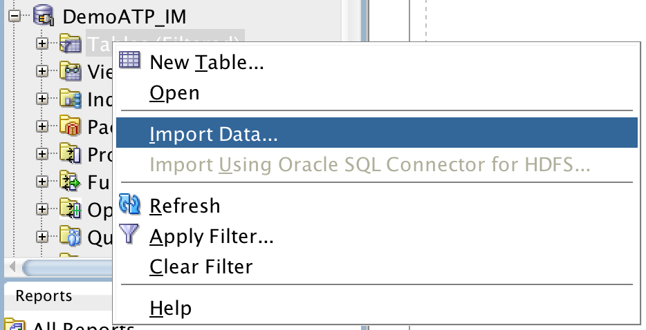
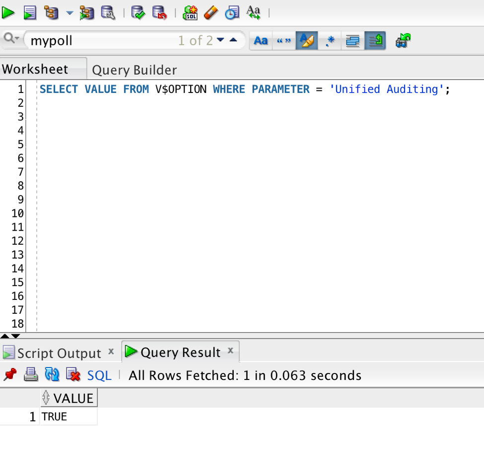
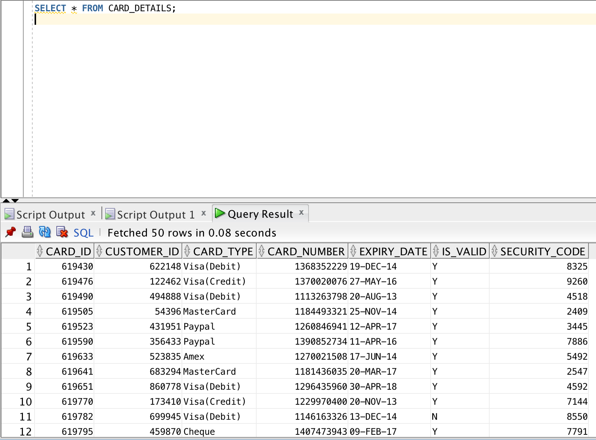
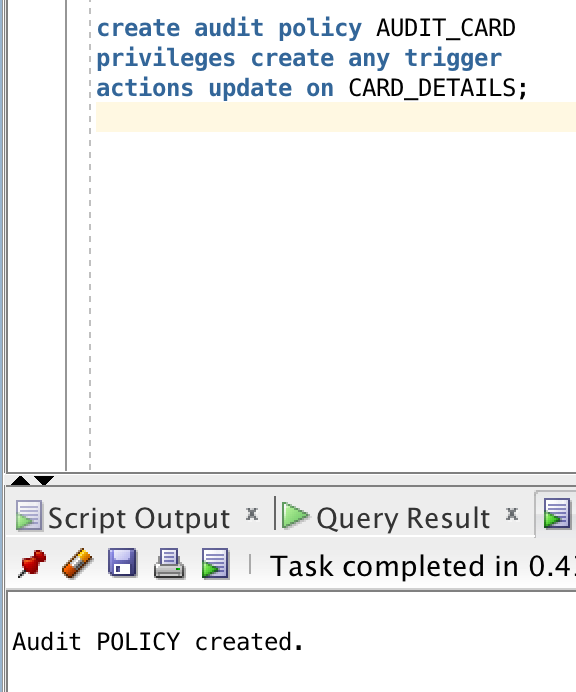
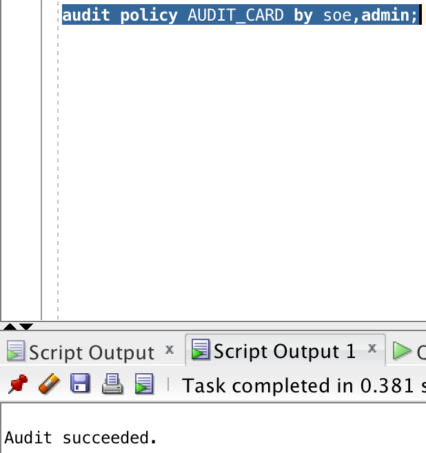
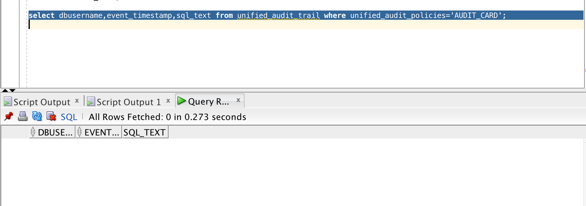

# UNIFIED AUDITING

Unified Auditing is enabled by default. You can audit the several types of activities, using unified audit policies and the AUDIT SQL statement.
All audit records are written to the unified audit trail in a uniform format and are made available through the UNIFIED_AUDIT_TRAIL view.
The unified audit trail captures audit information from many types of object, from SQL statements to other Oracle Database Components, such as Data Pump, SQL*Loader etc.

## Benefits of the Unified Audit Trail

- The audit records are placed in one location and in one format, rather than your having to look in different places to find audit trails in varying formats. 
- This consolidated view enables auditors to co-relate audit information from different components.
- The management and security of the audit trail is also improved by having it in single audit trail.
- Overall auditing performance is greatly improved. By default, the audit records are automatically written to an internal relational table
- You can create named audit policies that enable you to audit the supported components. Furthermore, you can build conditions and exclusions into your policies.

## Objectives
	
The objective of this lab is to create an audit policy for the update done on ORDERS table and then to query UNIFIED_AUDIT_TRAIL to view the generated audit records. 

We will do the following:

- Create an audit policy
- Enable the policy and apply audit settings to one or more users.
- View the generated audit records.

## Required Artifacts

- The following lab requires an Oracle Public Cloud account with Autonomous Data Warehouse Cloud Service.

- You need to have a connection to database through admin. 

    - Open up your SQL Developer and create a new connection for admin. If you already have a connection, skip this step. 

    - Enter the following details for admin:

        1.	Connection Name: DemoATP
        2.	Username: admin
        3.	Password: Password you entered while creating database on cloud.
        4.	Connection Type: Cloud PDB
        5.	Configuration File: Path to your wallet
        6.	Keystore Password: Password entered while downloading wallet. 

        

    - Click on Test, if it shows success, click on save and then click on connect. 
    
### **Step 1**: Create CREDIT_DETAILS table in Autonomous Database.

- Download the csv file. [CREDIT_DETAILS.csv](card_details.csv)

- Upload data from the following csv file in your autonomous database.

    1. Right click on **table** and then **import data**.

        
        
    2. Leave the source as **Local File**, click on Browse and select the downloaded csv file.
    
        
        
    3. Click on next till you reach the review page and click on finish. Table is created and the data is loaded.

### **Step 2**: CREATE AN AUDIT POLICY

- After you are successfully loading the data in database as admin, open up a SQL worksheet and type the following SQL statement:

    **SELECT VALUE FROM V$OPTION WHERE PARAMETER = 'Unified Auditing';**
    
  The result should be TRUE. This shows that the unified auditing is enabled by default in your database. 
  
  

- Lets create audit policy in card_Detail table. 
  Enter the following SQL sentence in SQL Worksheet:
  
  **Select * from CARD_DETAIL;**
  
    

- After verifying the data, lets create the audit policy named **AUDIT_CARD**. 
  This policy will audit the UPDATE activity on CARD_DETAILS table.   
  
    

    The output should be “Audit POLICY created”.

### **Step 3**: Enable the policy and apply audit settings to one or more users.

- The AUDIT statement with the POLICY clause enables a unified audit policy. Use the BY clause to apply the policy to one or more users
  Copy paste the following to your SQL Workbench:

    **audit policy AUDIT_CARD by soe,admin;**

    
    
    The output should be “Audit succeeded”.
    
**NOTE** : When unified auditing is enabled in Oracle Database, the audit records are populated in this new audit trail. This view displays audit records in tabular form by retrieving the audit records from the audit trail.
Be aware that if the audit trail mode is QUEUED, then audit records are not written to disk until the in-memory queues are full. The following procedure explicitly flushes the queues to disk, so that you can see the audit trail records in the UNIFIED_AUDIT_TRAIL view:

**EXEC SYS.DBMS_AUDIT_MGMT.FLUSH_UNIFIED_AUDIT_TRAIL;**

- Now lets see if the policy is created. Enter the following command in SQL Workbench:
  
  **SELECT policy_name, enabled_opt, user_name
  FROM audit_unified_enabled_policies
  WHERE policy_name = 'AUDIT_CARD'
  ORDER BY user_name;**

  

- The ENABLED_OPT shows if a user can access the policy. You can also exclude users from unified policy: 

  **AUDIT POLICY MYORDERS EXCEPT USERNAME;**

### **Step 3**: View the generated audit records
  
- In order to look at all audit records, query the UNIFIED_AUDIT_TRAIL table.

  Copy paste the following SQL statement:

  **select dbusername,event_timestamp,sql_text from unified_audit_trail where unified_audit_policies='AUDIT_CARD';**

  
  
  Right now, there are no updates made on this table, hence it shows no result.
  
- Lets update the table. Copy paste the following in your worksheet:

  **update CARD_DETAILS set SECURITY_CODE = 9340 where CARD_ID = 619430;**

  

- Now run the same command again:

  **select dbusername,event_timestamp,sql_text from unified_audit_trail where unified_audit_policies='AUDIT_CARD';**

  

  